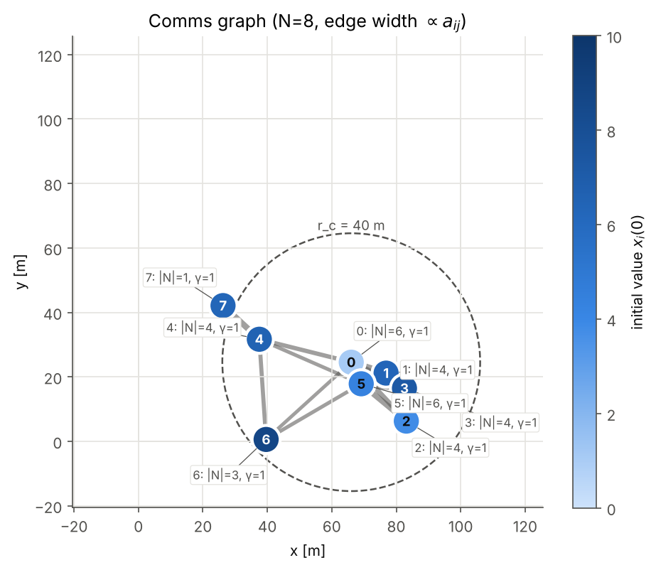
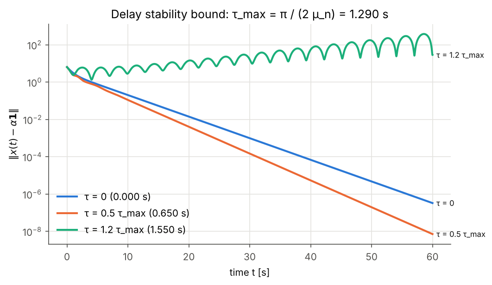

# Self Coordinating Swarm

**Objective-driven shared autonomy for UAS swarms: a minimal simulation proof of concept.**

UC Berkeley MEng Capstone (Fung Institute), Project 212, 2026-2027, sponsored by the U.S. Army
Research Laboratory.
Advisor: Prof. Mark Mueller (UC Berkeley ME) · Day-to-day contact: Christian Brommer

---

## Why this project

Today one operator usually supervises one drone, or a small centrally controlled group. That does not scale, and the central node is a single point of failure. This project asks a different question: what if the operator only says **what** needs to happen ("find the missing person in this sector") and the swarm works out **who does what**, adapting on its own when a drone fails or the radio link drops?

The goal is **architectural validation**, not algorithm optimization or hardware deployment. We want the smallest simulation that shows operator intent flowing through decentralized communication into agent-level decisions.

## Research questions

1. **Operator burden.** How can objective-driven interaction reduce operator load in one-to-many systems, and what structures let a swarm adapt to unforeseen events while keeping the mission objective?
2. **Information and communication.** What message and communication structures let an operator express objectives, and let agents negotiate strategy, allocate tasks and reach distributed consensus in a changing environment?
3. **Autonomy architecture.** Given that communication layer, which architecture and agent behavior paradigm best turns a shared objective into decentralized decisions while staying modular and extensible?

## Team and workstreams

| Pillar | Owner | Focus |
|---|---|---|
| Communications | Leonard Wang | Message formats, link models, information propagation under range limits and dropouts |
| Autonomy hierarchy | Maria Vlahos | Operator intent to mission to task decomposition, levels of autonomy |
| Multi-agent autonomy | Yuki Kin | Distributed consensus, task allocation, agent decision making |

## Reference scenario

**2D post-disaster search.** A person is missing somewhere in a sector. The operator gives one objective (search region plus priority). Each drone has a limited sensor and a limited radio range. Drones keep a probability map of where the person might be, update it from their own observations, and fuse it with neighbors through graph-Laplacian consensus (after Olfati-Saber, Fax and Murray, 2007). Stress tests inject drone failures and communication blackouts.

See [`docs/scenarios.md`](docs/scenarios.md).

## Current status

**Step 1 is done:** 8 static drones agree on one scalar, with comms delay, information weights and
normalization by neighbour count. The simulation matches theory: it converges to the predicted
weighted value, decays at rate mu_2, and is stable exactly below the delay bound pi / (2 mu_n).
See [`docs/consensus_step1.md`](docs/consensus_step1.md).

<p align="center">
  
  
</p>

**Interactive demo:** open [`tools/consensus_lab.html`](tools/consensus_lab.html) in a browser. It shows the swarm diagram, fleet roles (task, backups, out of service), a failure with backup takeover, packet loss and fading information, live A / D / L matrices, charts and a comms transcript. It goes beyond the Python step 1: packet loss, age weighting, sensor types and roles are only in the demo so far.

**Next:** moving drones with switching topology, vector states, and the 2D search scenario (see
[`docs/roadmap.md`](docs/roadmap.md)).

## Quick start

```bash
git clone https://github.com/yukikin0505/Capstone.git
cd Capstone
python -m venv .venv && source .venv/bin/activate   # Windows: .venv\Scripts\activate
pip install -e ".[dev,viz]"

# step 1: static consensus with delay sweep (prints a summary table)
python -m swarm --config configs/consensus_static.yaml

# same, and save + show the figures (outputs/)
python -m swarm --config configs/consensus_static.yaml --plot

# two drones with higher information weight
python -m swarm --config configs/consensus_weighted.yaml --plot

# tests and lint
pytest
ruff check src tests
```

Planned once the search scenario exists: `configs/search_rescue_2d.yaml` (baseline) and
`configs/stress_failures.yaml` (drone failure + comms blackout).

## Repository layout

```
.
├── src/swarm/            # simulation package
│   ├── config.py         # scenario parameters, loaded from YAML
│   ├── comms.py          # communication graph: range, link weights, message delivery
│   ├── consensus.py      # Laplacian consensus primitives (pure math)
│   ├── sim.py            # simulation loop, metrics, scenario runners
│   ├── viz.py            # figures (optional matplotlib)
│   ├── __main__.py       # CLI entry point: python -m swarm --config ...
│   ├── operator.py       # (planned) operator objectives, the intent layer
│   ├── world.py          # (planned) 2D grid world, target, sensor model
│   └── agent.py          # (planned) agent belief update and motion policy
├── configs/              # scenario YAML files
├── tests/                # pytest suite
├── examples/             # small runnable scripts
├── tools/                # standalone browser demos (consensus_lab.html)
└── docs/                 # architecture, scenarios, roadmap, literature, meeting notes, decisions
```

## Project roadmap

1. Split research areas
2. Literature review
3. Scoping (scenario choice)
4. Functional requirements
5. Technical choices
6. System architecture
7. Demonstrator
8. Scenario testing (comms loss, drone failure, GPS loss, ...)
9. Final evaluation

Details and status in [`docs/roadmap.md`](docs/roadmap.md).

## Meetings

- **Tuesday 13:00-14:00**: advisor meeting (Mark Mueller, Christian Brommer)
- **Friday 13:00-15:00**: team working session

Notes live in [`docs/meetings/`](docs/meetings/).

## Contributing

See [`CONTRIBUTING.md`](CONTRIBUTING.md). Short version: branch off `main`, keep PRs small, add a test for new behavior, record architecture choices as an ADR in `docs/decisions/`.

## License

MIT, see [`LICENSE`](LICENSE).
