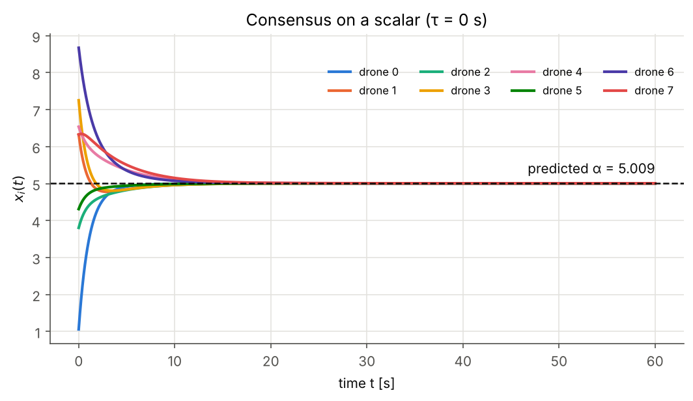
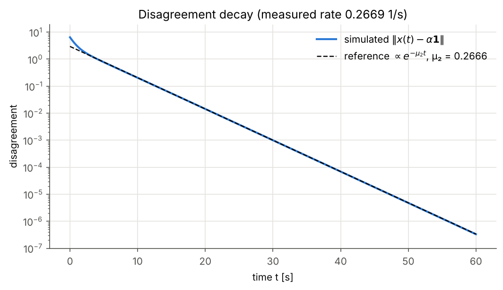

# Step 1: scalar consensus with delay, information weights and neighbour normalization

Eight drones sit at fixed random positions and agree on one number `x` (think "each drone's
estimate of something"). Nothing moves yet and there is no sensing. The point is to check that the
consensus law behaves as theory predicts before we build the search scenario on it.
Design rationale: [ADR 0001](decisions/0001-weighted-delayed-consensus.md).

## How to run

```bash
python -m swarm --config configs/consensus_static.yaml           # summary table
python -m swarm --config configs/consensus_static.yaml --plot    # + figures in outputs/
python -m swarm --config configs/consensus_weighted.yaml --plot  # drones 0 and 3 with gamma = 2
```

To change parameters (r_c, sigma, tau, dt, seed, gamma overrides, the delay sweep), copy a YAML
file in `configs/` and edit it. All keys and their defaults are in `src/swarm/config.py`.

| code | role in step 1 |
|---|---|
| `comms.py` | positions (redrawn until connected), unit-disk links, weights `a_ij`, `deliver()` |
| `consensus.py` | `consensus_step()` for one drone, Laplacians, spectrum, consensus value, delay bound |
| `sim.py` | message-passing loop, vectorized cross-check, metrics, `run_consensus_static()` |
| `viz.py` | the four figures below |
| `tests/test_sim.py` | every theory check below, run in CI |

## Equations

**Graph.** Link iff `d_ij = ||p_i - p_j|| <= r_c`. Weight `a_ij = exp(-d_ij^2 / sigma^2)` inside r_c,
otherwise 0, so closer drones count more. Links are stored as two directed edges (i->j, j->i), which
keeps the door open for asymmetric links later.

    A = [a_ij],   D = diag(sum_j a_ij),   L = D - A,   DeltaN = diag(|N_i|),   Gamma = diag(gamma_i)

**Consensus law (per drone i, only local information):**

    gamma_i * dx_i/dt = (1/|N_i|) * sum_{j in N_i} a_ij * ( x_j(t - tau) - x_i(t - tau) )

Matrix form: `dx/dt = -Lhat x(t - tau)`, with `Lhat = Gamma^-1 DeltaN^-1 L`.

**Discretization.** Forward Euler with step `dt`, delay rounded to `d = round(tau/dt)` steps,
constant history `x(t) = x(0)` for `t in [-tau, 0]`:

    x_i[k+1] = x_i[k] + dt / (gamma_i |N_i|) * sum_j a_ij * ( x_j[k-d] - x_i[k-d] )

In `sim.run_consensus()`, every drone broadcasts its value each step. `comms.deliver()` hands
drone i only the values its neighbours sent d steps earlier, and `consensus.consensus_step()`
updates from that inbox and the drone's own memory. `run_consensus_vectorized()` is the same
recursion written as `x[k+1] = x[k] - dt * Lhat x[k-d]`, and a test checks the two agree to round-off.

**Theory checked numerically**

| prediction | formula |
|---|---|
| consensus value | `alpha = sum_i w_i x_i(0) / sum_i w_i`, `w_i = gamma_i |N_i|` (w is the left null vector of Lhat, so `w.x` is conserved even with delay) |
| eigenvalues | Lhat is similar to symmetric `S = W^-1/2 L W^-1/2`, `W = Gamma DeltaN`, so its eigenvalues `0 = mu_1 < mu_2 <= ... <= mu_n` are real |
| convergence rate | `||x(t) - alpha 1|| ~ exp(-mu_2 t)` for tau = 0 |
| delay bound | consensus iff `tau < tau_max = pi / (2 mu_n)` |
| Euler stability | for tau = 0, need `dt < 2 / mu_n`; we use dt far below that |

## Results (default config, seed 1)

| quantity | value |
|---|---|
| \|N_i\|, drones 0-7 | 6, 4, 4, 4, 4, 6, 3, 1 |
| predicted alpha (weighted) / plain average | 5.0087 / 5.5367 |
| simulated x(T), all drones | 5.00874 (max error 2.4e-7), w.x conserved to 3e-15 |
| mu_2 / mu_n / lambda_2(L) | 0.2666 / 1.2174 / 0.5694 |
| tau_max = pi / (2 mu_n) | 1.290 s |
| time to within 1% of alpha | 14.0 s |
| measured decay rate vs mu_2 | 0.2669 vs 0.2666 |
| tau = 0.5 tau_max | converges, decay rate 0.331 (predicted 0.330, see below) |
| tau = 0.95 / 1.05 tau_max | decays / grows, at both dt = 0.01 and 0.001 |






1. **Comms graph.** Edge width is proportional to `a_ij`, node colour is `x_i(0)`, each label gives
   the drone id, `|N_i|` and `gamma_i`, and the dashed circle is the r_c disk around drone 0.
2. **States.** Every `x_i(t)` meets at the dashed line (predicted alpha), which is not the plain
   average.
3. **Disagreement.** After a short transient the log curve is a straight line with the slope of
   `exp(-mu_2 t)`.
4. **Delay comparison.** Below the bound the disagreement decays; above it, it oscillates and grows.

## Notes

- A moderate delay can make convergence *faster*. The slow mode `y' = -mu_2 y(t - tau)` has, for
  `mu_2 tau < 1/e`, a real root `-r` with `r = mu_2 exp(r tau) > mu_2`
  (`consensus.delayed_mode_rate`). The fast modes (`mu_n tau` close to pi/2) are the ones that go
  unstable.
- The bound is sharp, and the instability is not caused by Euler: `test_delay_bound_is_sharp` runs
  0.95 and 1.05 tau_max for 200 s at dt and dt/10.
- A drone with no neighbours (`|N_i| = 0`) holds its value. This cannot happen yet because the layout
  is redrawn until the graph is connected, but it will matter once the topology switches.
